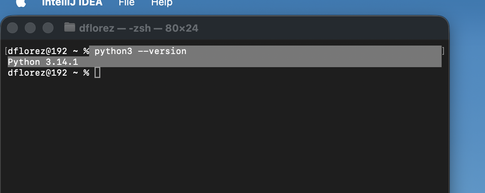

Que Es pyhton ?
......

Python es interpretado
 1) El codigo fuente se ejecuta directamente
 2) No se requeire compilar o crear archivos binarios
 3) Nos permite ejecutar por linea o se interpreta por linea

Ventajas 
 1) facil de depurar ->ejecutar en forma de debug o por lineas 
 2) no requiere compilacion previe
 3) Es mucho mas fexible
 4) MultiProposito  (Backend, Data Science, IA, Automatizaciones, etc)

Dinamicamente tipado
#inicio codigo
x = 1 #entero
x = "hola" #String
#fin codigo

Descargar e instalar Python
https://www.python.org/downloads/

para verificar la instalacion
´´´python
python --version
´´´

